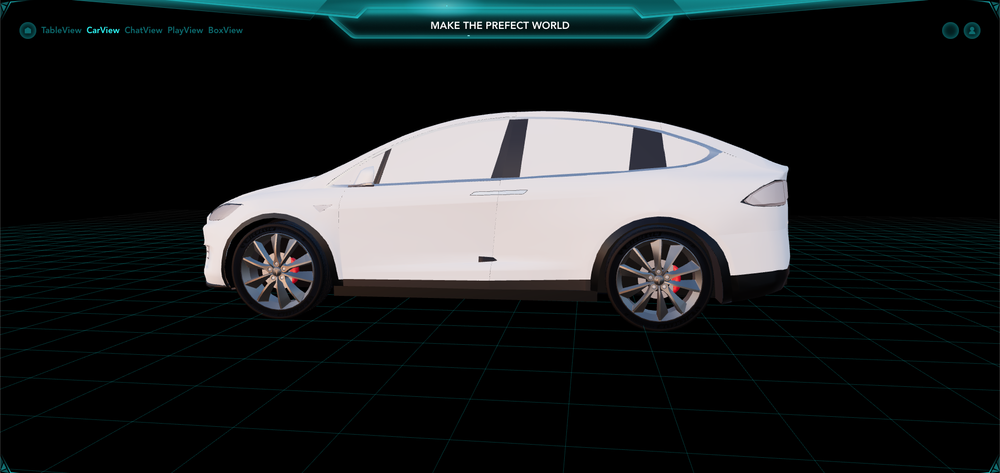
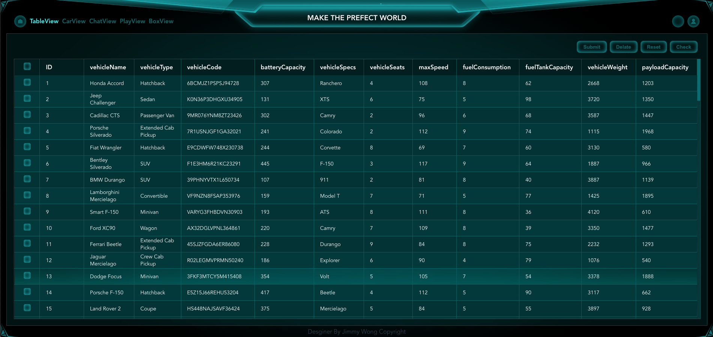

# Preview

# My Vue + Three.js Project

This is my awesome project built with Vue CLI and Three.js.

## Installation

1. Clone the repository: `git clone https://github.com/jimmyuong/car.git`
2. Navigate to the project directory: `cd car`
3. Install the dependencies: `npm install`

## Usage

1. Start the development server: `npm run serve`
2. Open your browser and visit: `http://localhost:8080`
3. Enjoy the magic!

## Project Structure

- `src/` - Contains the source code of your Vue.js application.
- `public/` - Contains the static assets and the `index.html` file.

## Available Scripts

In the project directory, you can run the following commands:

- `npm run serve` - Starts the development server.
- `npm run build` - Builds the production-ready files.
- `npm run lint` - Lints and fixes the source code.

## Additional Resources

- [Vue CLI Documentation](https://cli.vuejs.org/)
- [Three.js Documentation](https://threejs.org/docs/)

## License

This project is licensed under the [MIT License](LICENSE).
